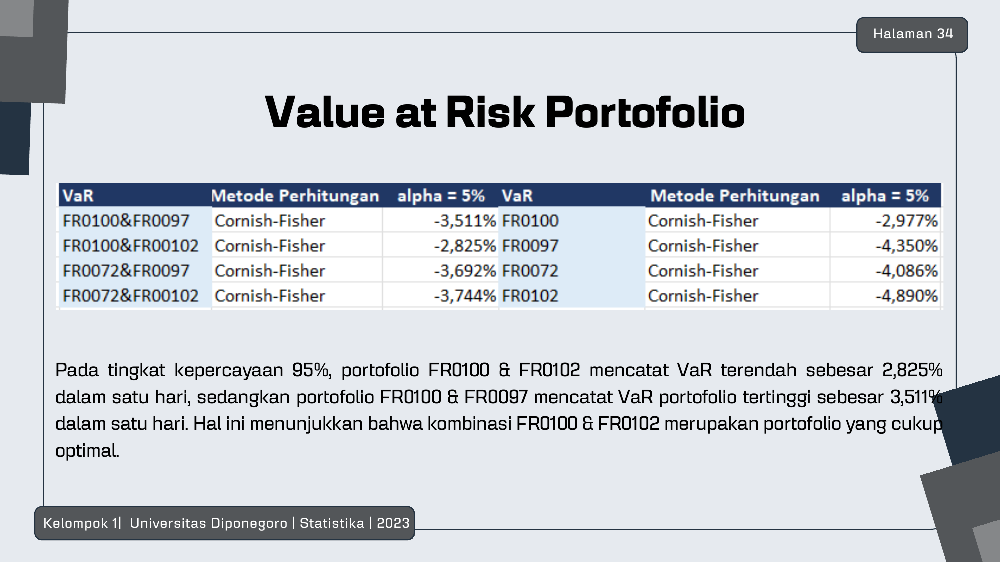
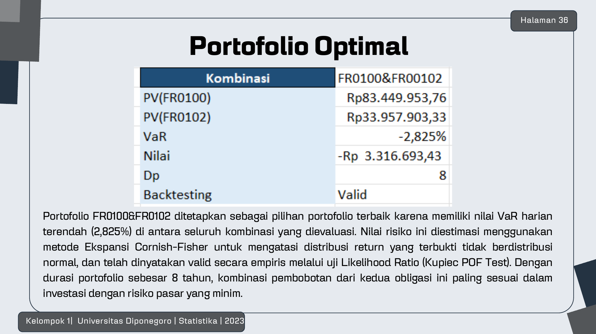

# Bond Portfolio Immunization with Cornish-Fisher VaR

> Duration-based immunization of Indonesian government bond portfolios (8-year horizon, Rp200M target), with market risk measured by **Cornish-Fisher Value at Risk** and validated by the **Kupiec Proportion-of-Failure backtest**.



## Problem

An investor with an 8-year horizon and a Rp200,000,000 target wants a government bond portfolio whose value is insensitive to interest-rate moves. Duration immunization solves the *rate-risk* side — but the investor still needs to know **how much can be lost on a bad day**, and bond returns are demonstrably *not* normal, so classical variance-covariance VaR understates tail risk.

## Data

- Daily secondary-market prices of four Indonesian fixed-rate government bonds — **FR0072, FR0097, FR0100, FR0102** — scraped from the BCA secondary bond market (~620 trading days, 2024–2026)
- FR-series bonds pay fixed semi-annual coupons, so cash flows are fully predictable; tenors range from ~8 to ~28 years to span different rate sensitivities

## Approach

1. **Yield to Maturity & Macaulay Duration** computed for each bond from its coupon schedule and market price
2. **Immunization:** for each of the 6 pairwise combinations, solve `w₁D₁ + w₂D₂ = 8 years`; combinations requiring short positions (negative weights) are excluded → 4 feasible portfolios; fund allocation simulated to reach Rp200M at horizon
3. **Risk measurement:** daily portfolio returns → Jarque-Bera normality test (all series reject normality, excess kurtosis up to ~15) → **95% 1-day VaR with the Cornish-Fisher expansion**, which corrects the Gaussian quantile for skewness and fat tails
4. **Backtesting:** Kupiec POF likelihood-ratio test against the χ²(1) critical value 3.8415

## Results

| Portfolio | 1-day 95% VaR (deck) | Kupiec LR | Verdict |
|---|---|---|---|
| **FR0100 & FR0102** | **2.825% (lowest)** | < 3.8415 | ✅ valid |
| FR0100 & FR0097 | 3.511% (highest) | < 3.8415 | ✅ valid |
| FR0072 & FR0097 | between | < 3.8415 | ✅ valid |
| FR0072 & FR0102 | between | < 3.8415 | ✅ valid |

- **FR0100 & FR0102 is the optimal immunized portfolio** — duration matched at 8 years with the lowest tail risk of all feasible combinations
- Kupiec POF: 22–26 violations over 616 days for every portfolio, LR between 0.83 and 2.27 — the Cornish-Fisher VaR model is **statistically valid** at the 5% level
- The Python notebook in `notebooks/` independently re-implements the pipeline from the raw price panel and reproduces every qualitative conclusion (same excluded combos, same optimal portfolio, all backtests pass)



## Repository Structure

```
├── notebooks/bond_immunization_var_cf.ipynb    # Python re-implementation (executed)
├── data/bond_immunization_workbook.xlsx        # original analysis workbook (durations, weights, VaR, backtest)
├── figures/                                    # key tables/charts from the study
└── reports/presentation_bond_immunization.pdf  # slide deck (Indonesian)
```

## Reproducing

```bash
pip install numpy pandas scipy matplotlib openpyxl
jupyter notebook notebooks/bond_immunization_var_cf.ipynb
```

## Authors

Group 1 — Portfolio Optimization B, Statistics, Diponegoro University:
**Wong Ryan Sebastian** · Nadhifa Athaya Putri · Rahayu Indah Pratiwi · Gilbert Geraldo Purba · Tessa Marshanda Purba · Muhammad Hanif Muttaqin 'Alim

## Key References

- Maruddani, D. A. I. (2020). *Prediksi Value at Risk dengan Metode Ekspansi Cornish-Fisher.*
- Kupiec, P. (1995). *Techniques for verifying the accuracy of risk measurement models.*
- Fabozzi, F. J. (2008). *Bond Markets, Analysis, and Strategies* (7th ed.).
